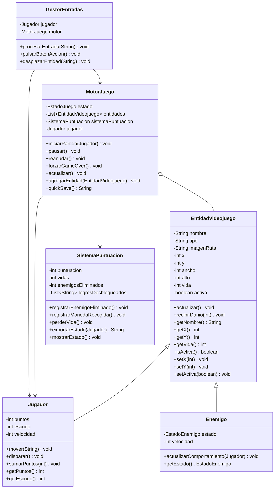
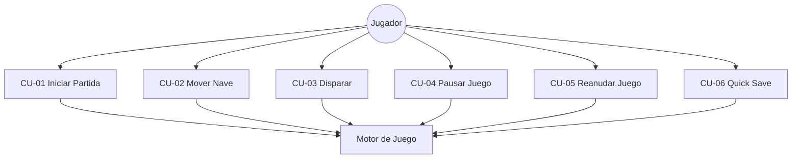

# 🚀 Motor de Juego - Naves Espaciales 2D

**Autor:** Almudena Godoy González
**Fecha:** Junio 2026
**Módulo:** Programación
**Temática:** Juego de scroll vertical de naves espaciales

---

## 1. Descripción del Juego

Motor básico para un videojuego de naves espaciales 2D con scroll vertical. El jugador controla una nave que debe esquivar y eliminar enemigos, recoger monedas y sobrevivir el mayor tiempo posible. El sistema simula por consola toda la lógica interna: movimiento, colisiones, comportamiento de enemigos y puntuación.

---

## 2. Arquitectura del Software

| Clase               | Descripción                                                                                                                      |
| ------------------- | -------------------------------------------------------------------------------------------------------------------------------- |
| `EntidadVideojuego` | Clase abstracta base. Define atributos comunes: posición (x,y), tamaño (w,h), vida, nombre, tipo e imagen.                       |
| `Jugador`           | Hereda de EntidadVideojuego. Representa la nave del jugador con movimiento, disparo y puntos.                                    |
| `Enemigo`           | Hereda de EntidadVideojuego. NPC con comportamiento automático: PATRULLAR, PERSEGUIR, ATACAR.                                    |
| `MotorJuego`        | Cerebro del juego. Gestiona el estado (MENU, JUGANDO, PAUSA, GAME_OVER), la lista de entidades, colisiones y el bucle de juego. |
| `GestorEntradas`    | Procesa comandos simulados del jugador (ARRIBA, ABAJO, ACCION, PAUSA...).                                                        |
| `SistemaPuntuacion` | Gestiona puntos, vidas, logros desbloqueados y exportación del estado (Quick Save).                                              |

---

## 3. Diagrama de Clases UML



---

## 4. Diagrama de Casos de Uso UML



---

## 5. Especificación de Casos de Uso

### CU-01: Iniciar Partida

| Campo                   | Descripción                                                                                                                                                     |
| ----------------------- | --------------------------------------------------------------------------------------------------------------------------------------------------------------- |
| **Nombre**              | CU-01 Iniciar Partida                                                                                                                                           |
| **Objetivo**            | El jugador inicia una nueva partida desde el menú principal.                                                                                                    |
| **Actor Principal**     | Jugador                                                                                                                                                         |
| **Precondiciones**      | El motor debe estar en estado MENU o GAME_OVER.                                                                                                                 |
| **Flujo Principal**     | 1. El jugador llama a iniciarPartida(). 2. El motor cambia estado a JUGANDO. 3. Se registra el jugador en la lista de entidades. 4. Se imprimen logs de inicio. |
| **Flujos Alternativos** | Si el estado no es MENU ni GAME_OVER, el sistema muestra mensaje de error y no inicia.                                                                          |
| **Postcondiciones**     | El motor queda en estado JUGANDO con el jugador registrado.                                                                                                     |
| **Reglas de Negocio**   | No se puede iniciar una partida si ya hay una en curso.                                                                                                         |

### CU-02: Detectar Colisión

| Campo                   | Descripción                                                                                                                                                                                                                |
| ----------------------- | -------------------------------------------------------------------------------------------------------------------------------------------------------------------------------------------------------------------------- |
| **Nombre**              | CU-02 Detectar Colisión                                                                                                                                                                                                    |
| **Objetivo**            | El sistema detecta si el jugador colisiona con un enemigo y aplica consecuencias.                                                                                                                                          |
| **Actor Principal**     | Sistema (automático en cada actualizar())                                                                                                                                                                                  |
| **Precondiciones**      | El motor debe estar en estado JUGANDO con al menos un enemigo activo.                                                                                                                                                      |
| **Flujo Principal**     | 1. El motor llama a detectarColisiones(). 2. Se comparan coordenadas y tamaños de jugador y enemigos. 3. Si hay colisión, el jugador recibe daño y pierde una vida. 4. El enemigo queda inactivo y se elimina de la lista. |
| **Flujos Alternativos** | Si no hay colisión, no ocurre ningún cambio de estado.                                                                                                                                                                     |
| **Postcondiciones**     | El jugador tiene menos vida y vidas. Si las vidas llegan a 0, el motor cambia a GAME_OVER.                                                                                                                                 |
| **Reglas de Negocio**   | La colisión se calcula con AABB (Axis-Aligned Bounding Box): dos rectángulos se solapan si sus coordenadas x,y,w,h se intersectan.                                                                                         |

---

## 6. Bitácora de Uso de Inteligencia Artificial

### Herramienta utilizada

**Claude (Anthropic)** - Usado como asistente de codificación y diseño de arquitectura a lo largo de toda la práctica, guiando paso a paso la implementación.

### Prompts utilizados

**Prompt 1 - Estructura base:**
> "Necesito que me ayudes a diseñar un motor básico de juego en Java para un juego de naves espaciales 2D. Máximo 6 clases: Main, MotorJuego, EntidadVideojuego (abstracta), Jugador, Enemigo, SistemaPuntuacion y GestorEntradas. Debe tener colisiones AABB, comportamiento NPC del enemigo con estados PATRULLAR/PERSEGUIR/ATACAR, sistema de logros y quick save en JSON simulado. Sin interfaz gráfica, todo por consola."

**Prompt 2 - Comportamiento NPC:**
> "En la clase Enemigo necesito que el método actualizarComportamiento reciba al jugador, calcule la distancia Manhattan y cambie automáticamente entre los estados PATRULLAR, PERSEGUIR y ATACAR según umbrales de distancia. Si ataca, debe llamar a recibirDanio() del jugador."

### Errores de la IA y correcciones

**Error detectado:** En la primera versión generada, la IA creó una clase extra llamada `GestorColisiones` separada, lo que superaba el límite de 6 clases permitidas por el enunciado. Además añadió métodos redundantes en `MotorJuego` que duplicaban lógica ya presente en `SistemaPuntuacion`.

**Corrección aplicada:** Se indicó a la IA que integrara la lógica de colisiones directamente dentro del método `actualizar()` de `MotorJuego` como método privado `detectarColisiones()`, eliminando la clase extra y respetando el límite de clases.

### Autoevaluación y Reflexión Crítica

**Ventajas de usar IA:**
- Acelera enormemente la generación de código boilerplate (getters, setters, constructores).
- Sugiere patrones de diseño correctos como el uso de enums para estados y herencia abstracta.
- Ayuda a detectar casos borde como qué ocurre cuando las vidas llegan a 0 durante el bucle.
- Guía paso a paso el flujo de trabajo Git con commits convencionales y estructura de ramas.

**Peligros de usar IA:**
- Tiende a sobre-ingenierizar: genera más clases de las necesarias si no se dan restricciones explícitas.
- El código generado puede compilar pero tener fallos lógicos sutiles en el orden de operaciones del bucle.
- Bajo presión de tiempo es tentador aceptar el código sin revisarlo, introduciendo errores difíciles de depurar.
- Es necesario supervisar siempre el output y entender cada línea generada para poder defenderla.

---

## 7. Instrucciones de Ejecución

### Requisitos Previos

- **JDK 21** o superior instalado en el sistema.
- Verificar instalación con: `java -version`

### Compilar el proyecto

Desde la raíz del repositorio ejecuta:

```bash
javac -d out src/main/java/motornaves/*.java
```

### Ejecutar el proyecto

```bash
java -cp out motornaves.Main
```

### Ejemplo de salida esperada

Al ejecutar, la consola mostrará logs con estos prefijos:
- `[MOTOR]` — acciones del motor de juego
- `[JUGADOR]` — movimientos y estado del jugador
- `[ENEMIGO]` — comportamiento NPC
- `[INPUT]` — comandos procesados
- `[PUNTUACION]` — puntos, vidas y logros
- `[COLISION]` — detección de colisiones AABB